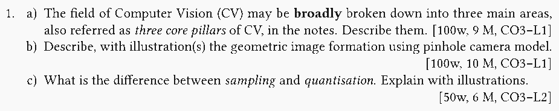

{ .tiet-logo }

**UNC512: Augmented and Virtual Reality**  
**TIET Patiala**

# Course Website

**Instructor(s)**:

`(RGB)` Raghav B. Venkataramaiyer `<bv.raghav -at-
thapar -dot- edu>`

<!-- ## Academic Calendar [:material-file-pdf-box:](assets/academic-calendar-ug2plus.pdf) ~^:material-information-outline:^~{ title="Requires thapar.edu login" } ## -->
## ~^(1)^~Academic Calendar [:material-file-pdf-box:](assets/academic-calendar-202526even.pdf) ##

1. Requires `thapar.edu` login

<iframe src="https://calendar.google.com/calendar/embed?height=600&wkst=1&ctz=Asia%2FKolkata&mode=AGENDA&hl=en_GB&title=Raghav%E2%80%99s%20Academic%20Calendar&src=YnYucmFnaGF2QHRoYXBhci5lZHU&src=Y18wZjhmMWI1OWFiOGI2YzdhN2NmMzg4YTRhZTRjYWE1NmQyYWFlYzBiODJhMjVhNjVlYTRkM2VhMWVjNjZhODU4QGdyb3VwLmNhbGVuZGFyLmdvb2dsZS5jb20&color=%23039be5&color=%23c0ca33" style="border:solid 1px #777" width="800" height="600" frameborder="0" scrolling="no"></iframe>

## Course Syllabus [:material-file-pdf-box:](assets/unc512-syllabus-2023.pdf) ##

[Download
:material-file-pdf-box:](assets/unc512-syllabus-2023.pdf)

## Evaluation ##

| Code        | Title                                  | Date                    | Weightage |
|-------------|----------------------------------------|-------------------------|-----------|
| `SESS#SEM1` | [Proj Eval 1](#proj-eval-1)            | CE                      | 10        |
| `MST`       | [Mid Sem Exam](#semester-exam-written) | TBA                     | 30        |
| `SESS#SEM2` | [Proj Eval 2](#proj-eval-2)            | CE/ Mon Apr 20, 3:30 PM | 20        |
| `EST`       | [End Sem Exam](#semester-exam-written) | TBA                     | 40        |

## Semester Project ##

Students shall partition themselves into teams of two
or three, in order to  
*a)* [propose an academic project][PROPOSAL-HOWTO]{: target="_blank"}
for the semester based on the course curriculum, and  
*b)* report the findings.

### Proj Eval 1 ###

Evaluation of the project proposal, and a mid-sem
progress monitoring.  This shall be conducted in
continuous evaluation mode [CE].

### Proj Eval 2 ###

Intermediate progress monitoring post MST in continuous
evaluation mode [CE], and Final evaluation based on a
seminar, tentatively scheduled on Mon Apr 20, 3:30 PM.

### Resources ###

1. [Project Proposal [HOWTO]][PROPOSAL-HOWTO]{: target="_blank"}

## Semester Exam (Written) ##

### Topic(s) Covered ###

For topics covered in MST/ EST, check out the [course
content](#course-content) for tags [MST] and [EST]
respectively

### Instructions ###

MST/ EST shall follow the following common proforma of
instructions,

1.  Word limit and marks shall be mentioned along with
    questions (e.g. [50w, 5M]).  Non-adherence
    **shall** be penalised.
2.  Attempt **all** parts of a question in one space.
    Only **the first** such space shall be evaluated.
3.  Fill the answer index on the first page of the
    answer sheet.
4.  Exchange of stationery/ equipment **is
    prohibited**.  Breach of code conduct may attract
    UMC.
5.  Do write your roll no. and name on the question
    paper.  **Do not** write anything else.
6.  Marks shall be awarded on the basis of solutions,
    **not** steps.

  
*Fig: Sample question in [MST]/[EST]*

### Choice ###

Typically, there is no choice in the MST and a choice
of **one** question in the EST.  But, of course, this
is subject to the erstwhile institute policy.

## Course Content ##

1. **[MST]**{: .htag} **[EST]**{: .htag}
   [:simple-googleslides: Overview, Introduction and
   Open Problems][L01]{: target="_blank" }.
2. **[MST]**{: .htag} **[EST]**{: .htag}
   [:simple-googledocs: (Scribe)][L02-SCRIBE]{: target="_blank"}
   [:simple-googleslides: Virtual Reality Input and
   Output Modalities][L02]{: target="_blank"}.

## Supplementary Course Content ##

**[Prerequisites]**{: .htag} Slide Courtesy:
[UTA027][UTA027]

1. [:simple-googleslides: Introduction to ML][UTA027-L06]{: target="_blank" }
2. [:simple-googleslides: Linear Regression][UTA027-L07]{: target="_blank" }
3. [:simple-googleslides: Classification and Logistic
   Regression][UTA027-L08]{: target="_blank" }
1. [:simple-googleslides: Neuron and it application in
   Regression/ Classification][UTA027-L13]{: target="_blank" }
3. [:simple-googleslides: Deep Neural Networks][UTA027-L14]{: target="_blank" }
1. [:simple-googleslides: Computer Vision Overview][UTA027-L16]
2. [:simple-googleslides: Computer Vision Problems][UTA027-L17]
3. [:simple-googleslides: Deep Learning in Computer
   Vision][UTA027-L18]{: target="_blank" }

More for the curious,

1. [:simple-googleslides: Support Vector
   Machines][UTA027-L09]{: target="_blank" }

## Course Learning Outcomes ##

The students will be able to: 
 
1. Analyze the components of AR and VR systems, its
   current and upcoming trends, types, platforms, and
   devices.
2. Compare technologies in the context of AR and VR
   systems design.
3. Implement various techniques and algorithms used to
   solve complex computing problems in AR and VR
   systems.
4. Develop interactive augmented reality applications
   for PC and Mobile based devices using a variety of
   input devices.
5. Demonstrate the knowledge of the research literature
   in augmented reality for both compositing and
   interactive applications.

## Resources ##

1. **[CL]**{: .htag } The Central Library
   [(Link)](https://cl.thapar.edu/){: target="_blank" }
   [(Koha Catalogue)](https://library.thapar.edu/){: target="_blank" }
2. **[RR]**{: .htag } RefRead
   [(Link)](https://tiet.refread.com/)
3. **[TB]**{: .htag} **[CL]**{: .htag } Doug A. B.,
   Kruijff E., LaViola J. J. and Poupyrev I. , 3D User
   Interfaces: Theory and Practice , Addison-Wesley
   (2005,2011p) 2nd ed. `ISBN: 9780134034324`
4. **[TB]**{: .htag} Parisi, T. (2015). Learning
   Virtual Reality: Developing Immersive Experiences
   and Applications for Desktop, Web, and
   Mobile. Japan: O'Reilly Media. `ISBN: 9781491922781`
5. **[TB]**{: .htag} **[CL]**{: .htag}
   Schmalstieg, D., Hollerer, T. (2016). Augmented
   Reality: Principles and Practice. United
   Kingdom: Pearson Education.  `ISBN:9780133153200`
6. **[RB]**{: .htag} Whyte, J. (2002). Virtual Reality
   and the Built Environment. United
   Kingdom: Architectural Press.  `ISBN: 9780750653725`
7. **[RB]**{: .htag} Aukstakalnis, S. (2017). Practical
   Augmented Reality: A Guide to the Technologies,
   Applications, and Human Factors for AR and
   VR. Netherlands: Addison-Wesley.  `ISBN:
   9780134094236`
3. **[CL]**{: .htag } Bishop, C. M. (2006). Pattern
   recognition and machine learning. Springer. `ISBN:
   9788132209065`
2. **[CL]**{: .htag } Cormen, T. H., Leiserson, C. E.,
   Rivest, R. L., & Stein, C. (2022). Introduction to
   Algorithms (Fourth). MIT Press. `ISBN:
   9788120340077`
4. **[CL]**{: .htag } Gareth James, Daniela Witten,
   Trevor Hastie, & Robert Tibshirani. (2013). An
   Introduction to Statistical Learning (1st
   ed.). Springer. `DOI: 10.1007/978-1-4614-7138-7`
   `ISBN: 9781461471387` [(Link)][ISLP]
5. **[CL]**{: .htag } MacKay,
   D. J. C. (2003). Information theory, inference and
   learning algorithms. Cambridge University
   Press. `ISBN: 9780521670517` [(Link)][ITILA]
6. Bertsekas, D., & Tsitsiklis,
   J. N. (2008). Introduction to probability
   (Vol. 1). Athena Scientific. `ISBN: 9781886529236`
   [(Google Scholar)][ITPB]
7. **[YT]**{: .htag } **[MOOC]**{: .htag } Introduction
   to Probability. [(MIT-OCW)][MIT-OCW-ITP] [(Archive
   2011)][ITPB-YT1] [(Archive 2018)][ITPB-YT2]
8. **[YT]**{: .htag } **[MOOC]**{: .htag } Algorithms
   Illuminated. by Tim Roughgarden [Videos: Part 1
   Basics][TRG-BASICS], [Videos: Part 2
   Graphs][TRG-GRAPHS] and [Official Website][TRG-WEB]
9. **[RB]**{: .htag } **[CL]**{: .htag } Jurafsky, D.,
   & Martin, J. H. (2025, January). Speech and Language
   Processing: An Introduction to Natural Language
   Processing, Computational Linguistics, and Speech
   Recognition. `ISBN: 9789332518414` [(The
   Book)][JM24-BOOK], [(The Chapter on Logistic
   Regression)][JM24-C5], [(Official
   Website)][JM24-WEB]
10. **[MOOC]**{: .htag } [Illinois Institute Page on
    Logistic Regression][ILL-LOG-REG].
11. **[YT]**{: .htag } Late Prof. Winston’s Lecture on
    SVM (MIT-OCW) [Video by MIT-OCW][MIT-OCW-SVM]

[^2]: Each assignment carries weightage of 2 marks

[^5]: Some of the assignments are competition and
    leaderboard based; Marks awarded shall be based on
    rank on leaderboard.

[^6]: ~~A01-05~~ A01-03 shall reflect on the webkiosk as
    consolidated `SESS#A1 (MM:10)`; and similary
    ~~A06-10~~ A04-07 as `SESS#A2 (MM:10)`.

*[CE]: Continuous Evaluation.

*[MST]: Mid Sem Exam.

*[EST]: End Sem Exam.

*[TBA]: To be announced.

*[TB]: Text Book.

*[RB]: Reference Book.

*[CL]: Accessible through the Central Library (Koha).

*[RR]: RefRead subscription accessible through TIET.

*[YT]: Youtube Video/Playlist.

*[MOOC]: Online Course (or a part of it.)

*[CE]: Continuous Evaluation, done as a part of contact hours, with an implicit attendance component.

[PY]: https://gist.github.com/bvraghav/7bd132bf4a93dfb4179673a377b324db
[GA]: https://gist.github.com/bvraghav/f2e910d7d30a2b8a0b9c288d61dd6bd9
[ITILA]: http://www.inference.org.uk/mackay/itila/book.html "ITILA Website"
[ISLP]: https://www.statlearning.com/ "ISLP Website"
[ITPB]: https://scholar.google.com/scholar?q=bertsekas+introduction+to+probability "Search for ITP"
[MIT-OCW-ITP]: https://ocw.mit.edu/courses/res-6-012-introduction-to-probability-spring-2018/ "MIT OpenCourseWare"
[ITPB-YT1]: https://www.youtube.com/playlist?list=PLmPcD-wiF4Ea_Doghiw3ya6XaLrmGrLUU "2011 Archive of Course Introduction to Probability by Bertsekas/Tsitsiklis"
[ITPB-YT2]: https://www.youtube.com/playlist?list=PLUl4u3cNGP60hI9ATjSFgLZpbNJ7myAg6 "2018 Archive of Course Introduction to Probability by Tsitsiklis/Jaillet"
[TRG-BASICS]: https://youtube.com/playlist?list=PLEGCF-WLh2RLHqXx6-GZr_w7LgqKDXxN_ "Roughgarden’s Playlist: Algorithms Basics"
[TRG-GRAPHS]: https://youtube.com/playlist?list=PLEGCF-WLh2RJ5W-pt-KE9GUArTDzVwL1P "Roughgarden’s Playlist: Algorithms Graphs"
[TRG-WEB]: https://www.algorithmsilluminated.org/ "Roughgarden’s Website"
[JM24-BOOK]: https://web.stanford.edu/~jurafsky/slp3/ed3book_Jan25.pdf "SLP Book"
[JM24-C5]: https://web.stanford.edu/~jurafsky/slp3/slides/5_LR_Apr_7_2021.pdf "SLP Chap 5: Logistic Regression"
[JM24-WEB]: https://web.stanford.edu/~jurafsky/slp3/ "SLP Website"
[ILL-LOG-REG]: https://exploration.stat.illinois.edu/learn/Logistic-Regression/Classification-with-Logistic-Regression/ "IIT Chicago Logistic Regression Page"
[MIT-OCW-SVM]: https://www.youtube.com/watch?v=_PwhiWxHK8o "Late Prof. Winston’s Lecture on SVM (MIT-OCW)"

[UTA027-L08]: https://docs.google.com/presentation/d/1yXqhpDXUvQwDPCr2DWO9kVT6WbHN5LJWGh-NVl_jw38/edit "UTA027 L08"
[UTA027-L07]: https://docs.google.com/presentation/d/1reC3s9I9jV-NaiqZLHElbcEhc8XhNs9ooJ7DdgP1Yfk/edit "UTA027 L07"
[UTA027-L06]: https://docs.google.com/presentation/d/1QPZ8WuCghOzjrcJfuJtUsCNkp1FgNY1tkpWFkW2w3II/edit "UTA027 L06"
[UTA027-L09]: https://docs.google.com/presentation/d/1ppeEjAraHZVvuQsS_J165oMpPBl_KYF2lZxosBqbcZY/edit?usp=sharing "ML: SVM"
[UTA027-L13]: https://docs.google.com/presentation/d/1Y0N7jhqgCFR6K1e48iIxqRxBkzKXEe27QUDyQ9_DGLc/edit?usp=sharing
[UTA027-L14]: https://docs.google.com/presentation/d/1KFQ3ztGe3x8qbO4NIzH70HzWeNYN86uedUQv-zfC0mw/edit?usp=sharing
[UTA027-L16]: https://docs.google.com/presentation/d/1EhaubS3KHKeyqSGbBWLxU1zQl9WbxQKGEoJdN4KVU8Y/edit?usp=sharing
[UTA027-L17]: https://docs.google.com/presentation/d/1AmYnJb1KzkuWEgvR0NJGY5V75znAuNqcmgsgKla7KA0/edit?usp=sharing
[UTA027-L18]: https://docs.google.com/presentation/d/1hSASwVI4EJd6ImJA-LFU6S4eSYcA-k0GDYmVdDGq77U/edit?usp=sharing

[UTA027]: https://tiet-uta027.github.io/a01 "UTA027: Artificial Intelligence &bull; Raghav B. Venkataramaiyer @TIET"

[L01]: https://docs.google.com/presentation/d/1I1VXZh4eZK2GuRmtKL5ch3Crl3dGhj0EeLquN1-0s9s/edit?usp=sharing "UNC512 L01 Overview, Introduction and Open Problems"
[PROPOSAL-HOWTO]: https://docs.google.com/document/d/11oCHkJQwGifkDLSH5DMWAUcJIApAidObK_lTBi2-414/edit?usp=sharing
[L02-SCRIBE]:
https://docs.google.com/document/d/1GQHLRgZLlIkAu_dkb73nkd4qNHLfpX-JeQqlGJe-Vwg/edit?usp=sharing "Virtual Reality Input and Output Modalities"
[L02]: https://docs.google.com/presentation/d/1epW0bQCru42_OiAmDbgMhsuxdlY0XQZcOkpiYMlXNso/edit?usp=sharing "Virtual Reality Input and Output Modalities"
